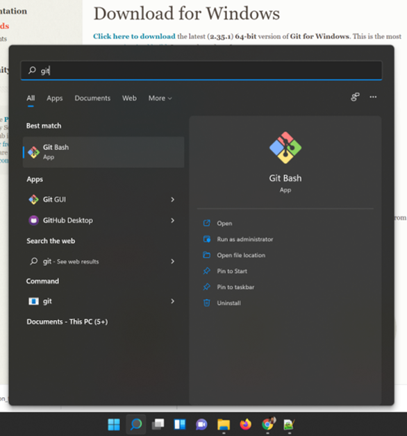
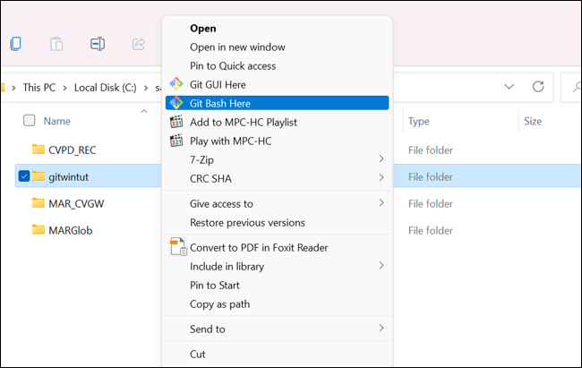
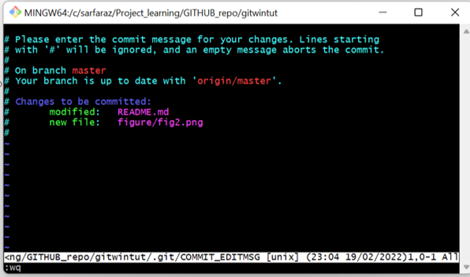
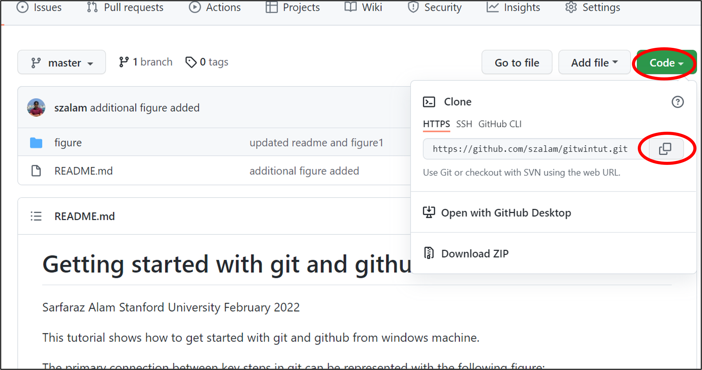

# Getting started with git and github from windows OS

* Author: Sarfaraz Alam, Stanford University

This tutorial shows how to get started with git and github from windows machine.

#### What is Git?
* Git is version control system (VCS) used to track changes in computer files
* It coordinates work between different developers
* Useful to track who mades changes and when changes mades
* Revert back in time
* The are both local and remote repositories (repos)

#### Why Git?
* Tracks code history
* Keeps 'snapshots' of files and one can decide when to take snapshots by using 'commit'
* One can visit any snapshot at any time
* Very useful to control version and track different component of a code which might be written by multiple people


#### The primary connection between key steps in git can be represented with the following figure:


#### Commonly used git commands
* git init		: Git repository initialize locally
* git add		: Add files to index
* git status	: Check status in the working tree
* git commit	: Commit changes in Index
* git push		: Push to Remote Repository
* git pull		: Pull latest from Remote Repository
* git clone		: Clone repository in a new directory in local computer
* git checkout	: Switching betwee different versions of Repository

# Lets get started

#### Download and install git for windows
* First download git for windows machine using the following link. I have downloaded the "64-bit Git for Windows Setup". Link to download: http://git-scm.com/download/win
* Install git using the setup files. After installation, You should be able to search 'Git Bash' when you search git in windows search.
* Click on 'Git Bash'

 <br>

#### Check git version
```git --version```

#### Open git bash at a specific folder
Right click on the folder you want to work and click "Git bash here" - this will open the git command prompt at that folder

 <br>

#### Increase/decrease font size or zoom in/out
ctrl+scroll zoom in/out

#### Creating new file using 'touch'
```touch index.html```

#### Initialize git repository
```
git init
```

#### Add name and email address to git:
```
git config --global user.name 'your name'
git config --global user.email 'your.email@gmail.com'
```

#### Add git file
```git add README.md```

#### If we want to see whats going on in the staging area we should type. It will show README.md is in the staging area.
```
git status
```

#### If we want to remove a file from the staging area
```
git rm --cached README.md
```

#### Add everything. This will add all folders and files in the repo
```git add .```

#### Now make some changes in the README.md file and type git status. It will show README.md was modified while it was in staging area
```git status```

#### Now git add again
```
git add .
git status
```

#### Now git commit
```git commit```

* This will open a file. If you want to edit then activate insert mode using clicking "i"
* Then uncomment any like or insert like "Initial commit"
* To save, first click Esc and then :wq and enter to same everything

 <br>

#### Now type git status, it will say nothing to commit
```git status```

#### Now if we want to commit but we want to skip the editor to open and manual editing shown before
```git commit -m 'Changed README.md' ```

#### To clear the window
```
clear
```

#### Now if we don't want to include specific files or folders to the git, we need git ignore. First create gitignore

```
touch .gitignore
```

#### Say we want to ignore log.txt
```touch log.txt```

#### Now open the gitignore file in text editor and type log.txt in that. Then type add and git status. The log.txt won't be added
```
git add .
git status
```

We can also ignore an entire folder. To do that, write /directory_name in the gitignore file

# Create Branches
* There are projects where multiple people working. One don't want to edit the main code base before finishing  the functionality. 
* Here, creating a branch is useful rather than working on the main branch (master)

#### lets create a branch
```
git branch test
git status
```

#### We are still in the master branch. To switch to the test branch type:
```
git checkout test
```

#### lets create new file while in the test branch
```
touch README2.md
```

#### Manually edit README2.md and type:
```
git add .
git commit -m 'README2 created'
```

#### Now lets switchback
``git checkout master``

#### Now if we want to merge the test branch
```git merge test```

If you are going to work on your own project, you might not even need a branch


# How to work on remote repository
First create a new repository in the github account

#### type git remote. But won't have anything as we are not connected to remote repo
```git remote```

#### adding a remote repo
```
git remote add origin https://github.com/szalam/gitwintut.git
```

#### typing git remote will show origin
```git remote```

#### push to remote repository. It might ask for login information
```git push -u origin master```

#### say we want to make a change and then upload
start editing README.md file. After editing
````
git add .
git commit -m 'Additional info added'
git push
````

#### To download the entire git directory, copy the git link from github website. Then click
```
git clone paste_the_directory
```
 <br>

* Relevant link: Instruction here: https://www.youtube.com/watch?v=SWYqp7iY_Tc
* Relevant Env GP link: https://github.com/envgp/sample_jupyter_notebooks